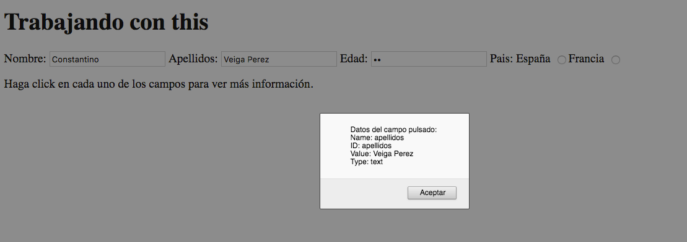

Si programamos una función para un botón, que al hacer click haga algo, si dentro de esa función usamos la palabra this, entonces estaremos haciendo referencia al objeto en el cuál hemos hecho click, que en este caso será el botón. El uso de this nos permite evitar usar variables globales, y el programar scripts más genéricos.

